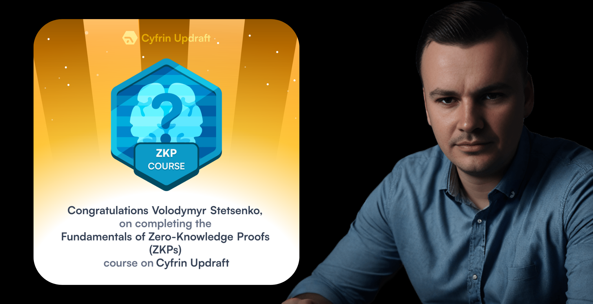

# Zero‑Knowledge Proofs Fundamentals: Notes & Projects

**Learning journey through Cyfrin Updraft’s _Fundamentals of Zero‑Knowledge Proofs (ZKPs)_ course.**  
This repository documents my progress, personal notes, example circuits, and further reading for anyone interested in understanding the basics of zero‑knowledge proofs. I built this repo as a learning aid and a showcase of my growing expertise in privacy‑preserving cryptography.

<div align="center">



</div>

## 🎓 About this project

I completed the [Fundamentals of Zero‑Knowledge Proofs](https://updraft.cyfrin.io/courses/fundamentals-of-zero-knowledge-proofs) course on **4 October 2025**.  
The course provides a high‑level introduction to ZKPs: what they are, why they’re powerful and where they’re used in blockchain.  
I took extensive notes, built small projects and collected references to create this repository. Everything here is my own work, inspired by the course content and additional research.

### What’s included?

- **📚 Notes** – concise markdown summaries of each section of the course: definitions, interactive vs non‑interactive proofs, trusted setups, proof of computation and more.
- **🛠️ Examples** – basic examples using [Noir](https://noir-lang.org/) and [Circom](https://docs.circom.io/) to illustrate how ZK circuits are written and verified.  These examples were written by me and tested locally.
- **🔗 Resources** – a curated list of articles, videos and open source projects for further study (including some newer links from 2025).
- **📸 Proof of work** – photos of my workstation while studying and the completion badge to authenticate my learning journey.

### Why zero‑knowledge?

Zero‑knowledge proofs allow a prover to convince a verifier that a statement is true without revealing _why_.  This opens up powerful privacy‑preserving applications in blockchain (anonymous transactions), identity (selective disclosure) and beyond. The course emphasises that even non‑developers can appreciate the conceptual beauty of ZKPs, while developers can dive into building circuits and using modern tooling like Noir and Circom.

## 🗂 Repository structure

```
├── notes/               # Markdown summaries for each course section
├── examples/            # Simple ZK circuits (Noir & Circom)
├── resources.md         # Curated list of additional learning materials
├── images (root)        # Photos & badges used in this repo (stored at the repo root)
└── LICENSE
```

## 📝 Sample notes

A quick preview of my notes (see the `notes/` folder for full content):

- **What is a Zero‑Knowledge Proof?** – A protocol where a prover convinces a verifier that a statement is true without revealing any additional information.  The classic Ali Baba cave metaphor shows how ZKPs can provide assurance without disclosure【895355980139095†L95-L126】.
- **Interactive vs non‑interactive** – Interactive proofs require communication between prover and verifier, whereas non‑interactive proofs (e.g., SNARKs) compress the interaction into a single proof using techniques like the Fiat‑Shamir transform【895355980139095†L119-L126】.
- **Trusted setup** – Many ZK systems rely on a setup phase to generate public parameters.  A multi‑party ceremony is often used to ensure no single participant can compromise the security【895355980139095†L135-L139】.

## 💻 Example: simple Noir circuit

Below is a tiny example written in [Noir](https://noir-lang.org/) that proves knowledge of a secret without revealing it:

```rust
// examples/noir/secret_guess/main.nr
// Prove you know a secret number `x` such that x^2 = 4 without revealing x.

fn main(private secret: Field) {
    let result: Field = secret * secret;
    assert(result == 4);
}
```

To test this example locally:

```bash
# Install the Noir toolchain (see https://noir-lang.org/getting-started/)
noir new secret_guess
cd secret_guess
# Replace the generated main.nr with the code above and then:
noir code check      # compile and check the circuit
noir run --private-input secret=2  # generate and verify a proof that 2^2=4
```

This demonstrates how ZKPs can prove knowledge of a secret value (2) without revealing it.

## 📚 Additional resources

In addition to the course materials, I explored several up‑to‑date resources to deepen my knowledge:

- [**Awesome Zero‑Knowledge Proofs**](https://github.com/matter-labs/awesome-zero-knowledge-proofs) – a curated list of libraries, papers and tutorials.
- [**ZK‑Learning.org course**](https://zk-learning.org/) – an open course created by Ethereum researchers covering both theory and practice.
- [**A Beginner’s Intro to Coding Zero‑Knowledge Proofs**](https://dev.to/spalladino/a-beginners-intro-to-coding-zero-knowledge-proofs-c56) – a great article by Santiago Palladino【895355980139095†L131-L133】.
- [**Vitalik Buterin’s posts on SNARKs and trusted setups**](https://vitalik.eth.limo/general/2021/01/26/snarks.html) – deeper insights on the cryptography behind ZKPs【895355980139095†L139-L149】.
- [**Top ZK Projects to Watch in 2025**](https://www.rumblefish.dev/blog/top-zkp-development-companies-to-watch-in-2025) – overview of companies pushing the boundaries in ZK technology.

Check `resources.md` for a full list with annotations and more links.

## 🙏 Acknowledgements

Huge thanks to **Cyfrin Updraft** for producing the _Fundamentals of Zero‑Knowledge Proofs_ course and to the course instructor(s) for making such a complex subject approachable. This repository was created as part of my learning journey and serves as a personal reference.  
Special thanks to [Patrick Collins](https://twitter.com/PatrickAlphaC) and the Cyfrin team for pioneering educational content in Web3 and security.  

## 📜 License & disclaimer

All original content in this repository (notes, code and examples) is released under the [MIT license](LICENSE) for educational purposes.  
The course materials referenced belong to Cyfrin Updraft and are licensed under GPLv3【895355980139095†L206-L208】.  
Please review each linked resource’s license before using it in your own projects.

## 📫 Contact

You can reach me via:

- [X (Twitter)](https://x.com/carstetsen)
- [Telegram](https://t.me/Zero2Auditor)
- [LinkedIn](https://www.linkedin.com/in/volodymyr-stetsenko-656014246/)

I welcome feedback, suggestions and collaboration requests!

